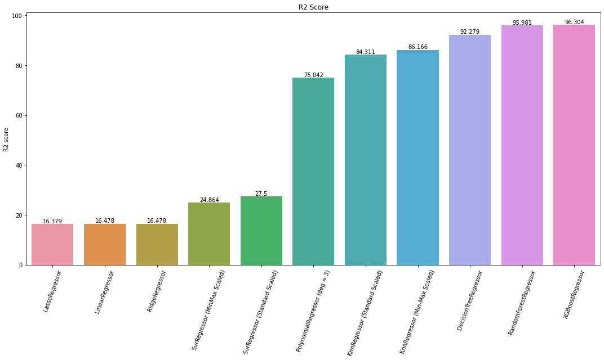
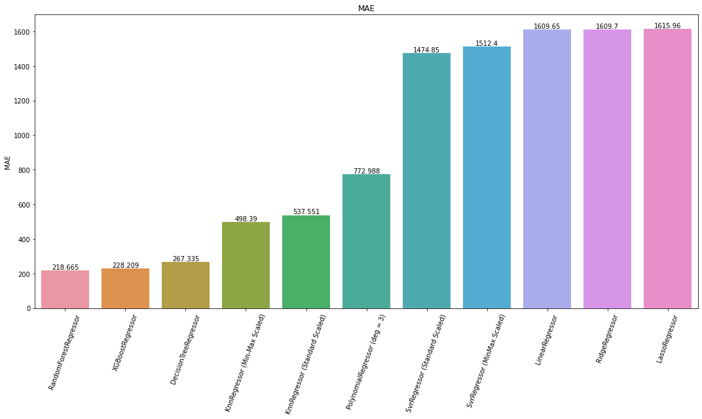
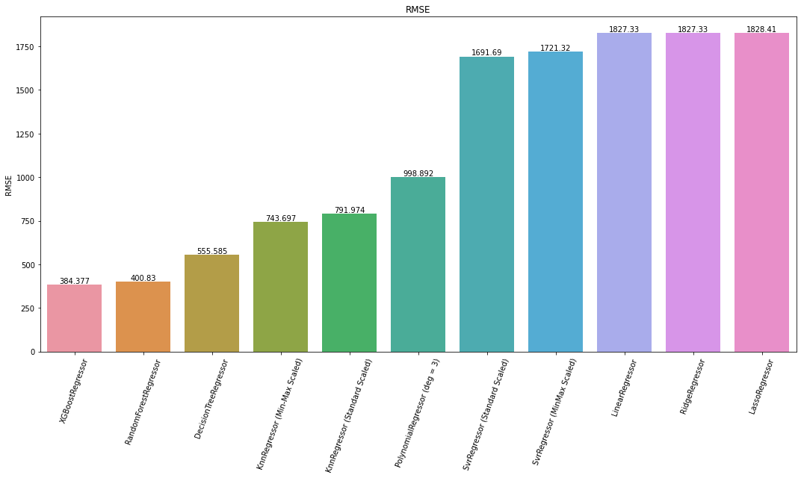
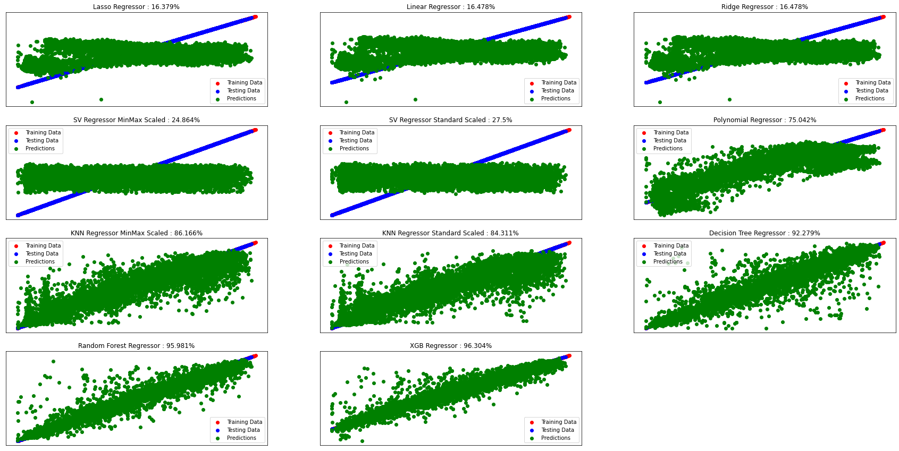

# Traffic Flow Prediction using Machine Learning

Accurate and timely traffic flow information is crucial for individual travelers, business sectors, and government agencies. It can aid road users in making better travel decisions, alleviate traffic congestion, reduce carbon emissions, and improve traffic operation efficiency. This research paper presents several techniques of machine learning to predict traffic flow accurately. Various machine learning algorithms are utilized, and the performance of different models is compared using specific performance metrics such as R2 scoring, mean squared error, and root mean squared error.

## Objective
The objective of this research is to develop a machine learning model that can accurately predict traffic flow. By doing so, it aims to provide valuable traffic flow information that can benefit individual travelers, businesses, and government agencies in managing traffic effectively and improving overall transportation systems.

## Methods
Several machine learning algorithms are employed in this study to predict traffic flow. These algorithms are trained using historical traffic data, and their performance is evaluated using different metrics to determine the most effective model for traffic flow prediction.

## Performance Metrics

#### R2 comparison graph

#### Mean Absolute Error comparison graph

#### Root Mean Squared Error comparison graph

#### All Models comparison graph

## Conclusion
By leveraging machine learning techniques and performance evaluation metrics, this research contributes to the development of accurate traffic flow prediction models. These models have the potential to significantly impact transportation systems by providing actionable insights for better traffic management and decision-making.